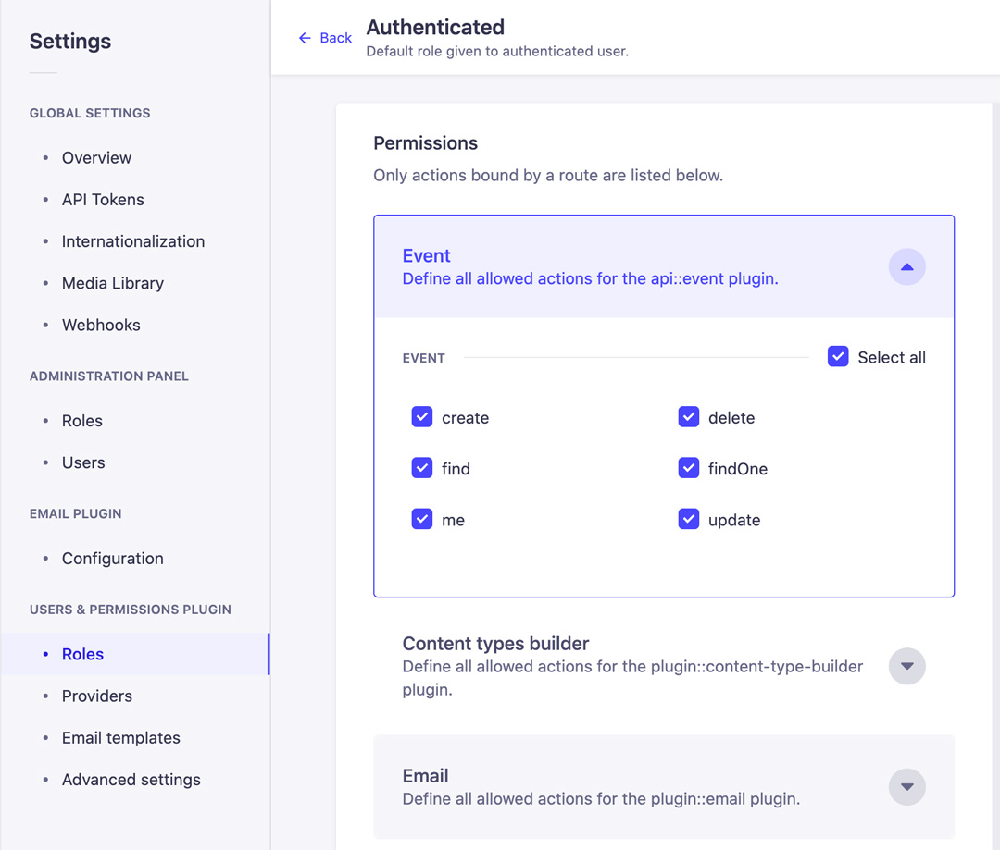
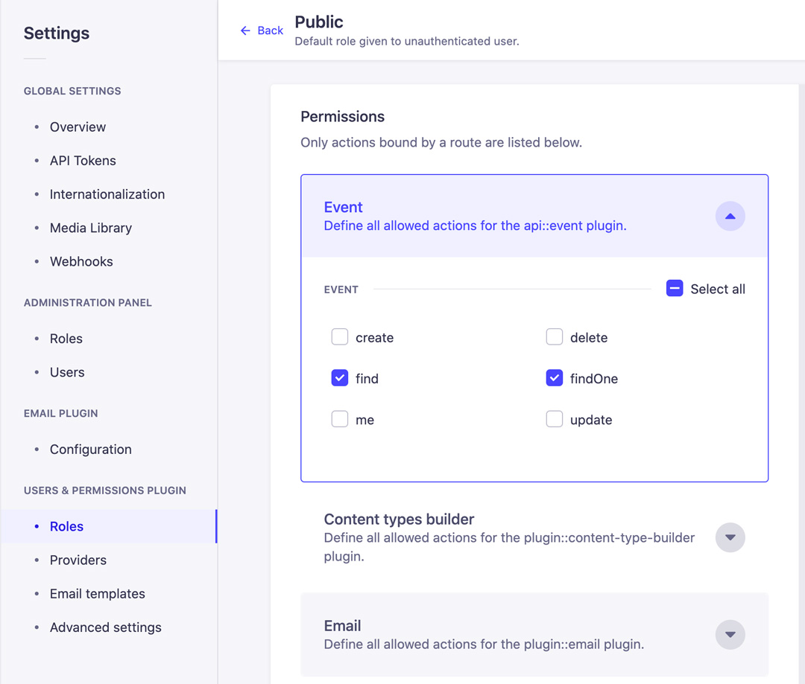

# Strapi V4 | Custom API Endpoint

> Develop Strapi V4 custom API endpoint

<br/>

## Usage

### Install Dependencies

```bash
npm install
```

### Run Strapi

```bash
npm run develop
```

> http://localhost:1337

<br/>

## User & Permission Settings





<br/>

## Events CRUD (Postman)

### Get All Events

> `Access` Public <br/> `GET` http://localhost:1337/api/events

```json
"result"

{
  "succes": true,
  "count": 3,
  "data": [
    {
      "id": 1,
      "title": "demo title",
      "slug": "demo-title",
      "description": "Lorem ipsum dolor sit amet, consectetur adipiscing elit",
      "user": {
        "id": 1,
        "username": "admin",
        "email": "admin@demo.com"
      }
    }
    "..."
  ]
}
```

### Create Event

> `Access` Private Authenticated User <br/> `POST` http://localhost:1337/api/events

```json
"Postman"
"Body / raw / JSON"

{
  "title": "demo title",
  "description": "Lorem ipsum dolor sit amet, consectetur adipiscing elit",
  "createdAt": "2021-12-31T00:00:00.000Z",
  "updatedAt": "2021-12-31T00:00:00.000Z",
  "publishedAt": "2021-12-31T00:00:00.000Z"
}
```

```json
"result"

{
  "succes": true,
  "data": {
    "id": 1,
    "title": "demo title",
    "description": "Lorem ipsum dolor sit amet, consectetur adipiscing elit",
    "createdAt": "2021-12-31T00:00:00.000Z",
    "updatedAt": "2021-12-31T00:00:00.000Z",
    "publishedAt": "2021-12-31T00:00:00.000Z",
    "slug": "demo-title"
  }
}
```

### Get Single Event

> `Access` Public <br/> `GET` http://localhost:1337/api/events/:id

```json
"result"
"http://localhost:1337/api/events/1"

{
  "succes": true,
  "data": {
    "id": 1,
    "title": "demo title",
    "slug": "demo-title",
    "description": "Lorem ipsum dolor sit amet, consectetur adipiscing elit",
    "user": {
      "id": 1,
      "username": "admin",
      "email": "admin@demo.com"
    }
  }
}
```

### Update Event

> `Access` Private Authenticated User <br/> `PUT` http://localhost:1337/api/events/:id

```json
"Postman"
"Body / raw / JSON"

{
  "title": "update demo title"
}
```

```json
"result"
"http://localhost:1337/api/events/1"

{
  "succes": true,
  "data": {
    "id": 1,
    "title": "demo title",
    "slug": "update-demo-title",
    "description": "Lorem ipsum dolor sit amet, consectetur adipiscing elit",
    "user": {
      "id": 1,
      "username": "admin",
      "email": "admin@demo.com"
    }
  }
}
```

- if the user is not the owner of the event

```json
"result"
"http://localhost:1337/api/events/2"

{
  "data": null,
  "error": {
    "status": 401,
    "name": "UnauthorizedError",
    "message": "You can't update this entry",
    "details": {}
  }
}
```

### Delete Event

> `Access` Private Authenticated User <br/> `DELETE` http://localhost:1337/api/events/:id

```json
"result"
"http://localhost:1337/api/events/1"

{
  "succes": true,
  "data": {}
}
```

### Get Me

- get all events related to authorized users

> `Access` Private Authenticated User <br/> `GET` http://localhost:1337/api/events/me

```json
"result"

{
  "succes": true,
  "count": 2,
  "data": [
    {
      "id": 1,
      "title": "demo title",
      "slug": "demo-title",
      "description": "Lorem ipsum dolor sit amet, consectetur adipiscing elit",
      "user": {
        "id": 1,
        "username": "admin",
        "email": "admin@demo.com"
      }
    }
    "..."
  ]
}
```

<br/>

## Authorization (Postman)

### Register User

> `Access` Public <br/> `POST` http://localhost:1337/api/auth/local/register

```json
"Postman"
"Body / raw / JSON"

{
  "username": "admin",
  "email": "admin@demo.com",
  "password": "demodemo"
}
```

```json
"result"

{
  "jwt": "eyJhbGciO...",
  "user": {
    "id": 1,
    "username": "admin",
    "email": "admin@demo.com",
    "provider": "local",
    "confirmed": true,
    "blocked": false,
    "createdAt": "2021-12-31T00:00:00.000Z",
    "updatedAt": "2021-12-31T00:00:00.000Z"
  }
}
```

### Login User

> `Access` Public <br/> `POST` http://localhost:1337/api/auth/local

```json
"Postman"
"Body / raw / JSON"

{
  "identifier": "admin@demo.com",
  "password": "demodemo"
}
```

```json
"result"

{
  "jwt": "eyJhbGciO...",
  "user": {
    "id": 1,
    "username": "admin",
    "email": "admin@demo.com",
    "provider": "local",
    "confirmed": true,
    "blocked": false,
    "createdAt": "2021-12-31T00:00:00.000Z",
    "updatedAt": "2021-12-31T00:00:00.000Z"
  }
}
```

<br/>

## Support Links

> Create a slug system
> <br/> https://docs.strapi.io/developer-docs/latest/guides/slug.html

> Entity Service API: CRUD operations
> <br/> https://docs.strapi.io/developer-docs/latest/developer-resources/database-apis-reference/entity-service/crud.html

> Controllers
> <br/> https://docs.strapi.io/developer-docs/latest/development/backend-customization/controllers.html

> How to Create a Custom API Endpoint in Strapi?
> <br/> https://strapi.io/blog/how-to-create-a-custom-api-endpoint-in-strapi

> How to add custom routes to core routes in Strapi 4
> <br/> https://forum.strapi.io/t/how-to-add-custom-routes-to-core-routes-in-strapi-4/14070/7

> Creating custom routers
> <br/> https://docs-next.strapi.io/developer-docs/latest/development/backend-customization/routes.html#creating-custom-routers
> | CAUTION |
> | ---------------------------------------------------------------------------------------------------------------------------------------------------------------------------------------- |
> | Routes files are loaded in alphabetical order. To load custom routes before core routes, make sure to name custom routes appropriately (e.g. 01-custom-routes.js and 02-core-routes.js). |
